1. Entra a la App Store y busca `tailscale` y descargalo

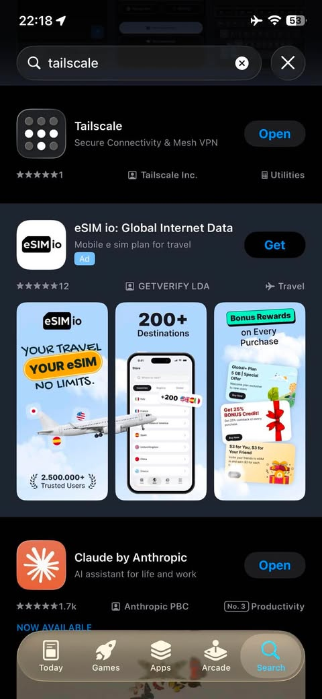

2. Ahora busca `documents` y descarga Documents: File Manager.

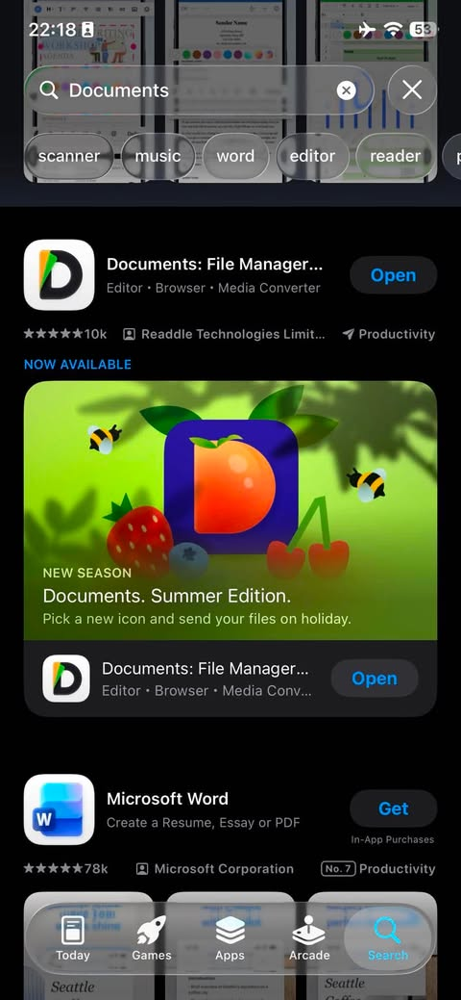

3. Abre Tailscale (Logo de puntos negros y blancos)

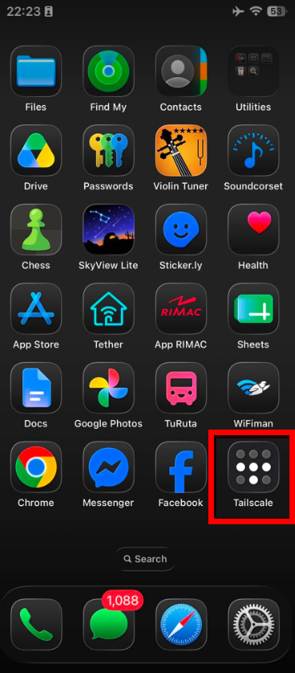

4. Selecciona el icono demarcado

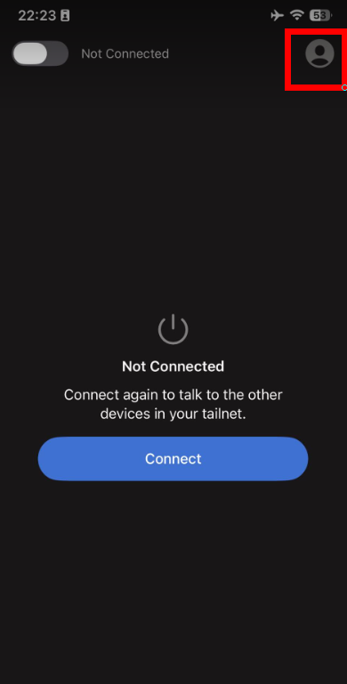

5. Selecciona "Log-In"

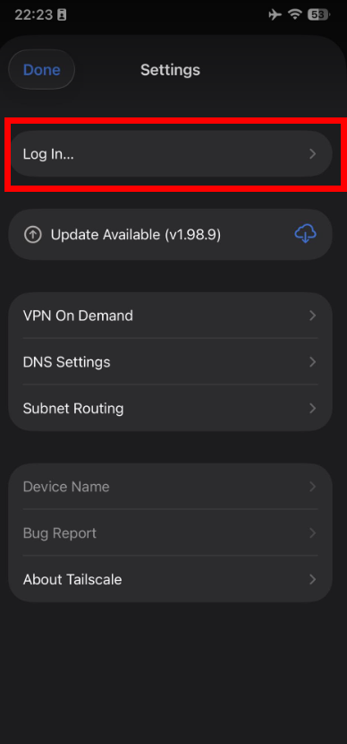

6. Selecciona `Add Account`

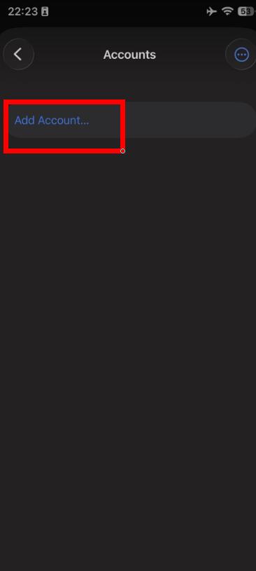

7. Registrate con un correo. Es recomendable hacerlo con google

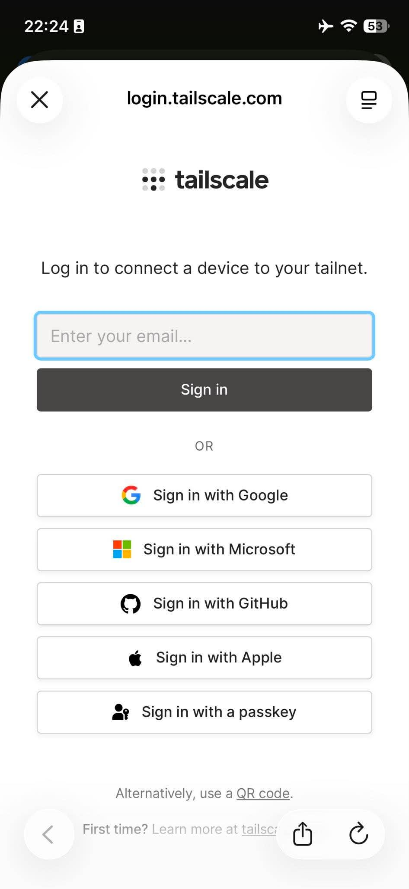

8. Seleciona `Continue`

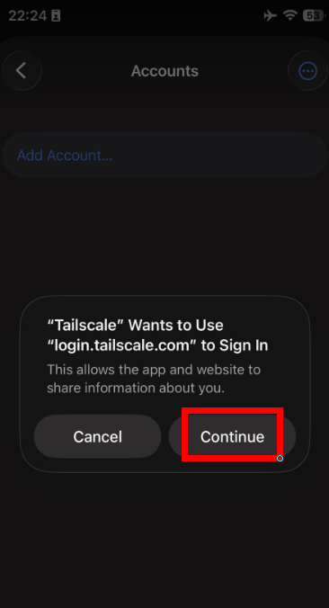

9. Selecciona "Connect"

10. Debe salir la siguiente interfaz

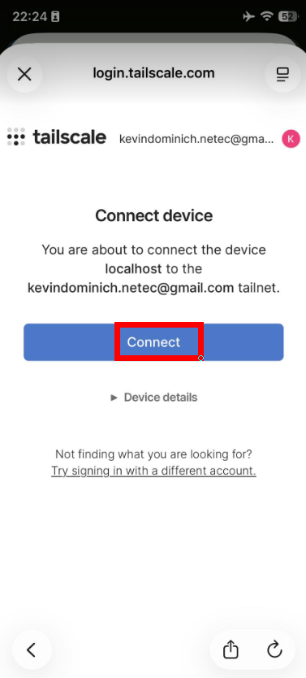

11. Debe aparecer logeado en la pantalla inicial, seleccionar el interruptor para encenderlo

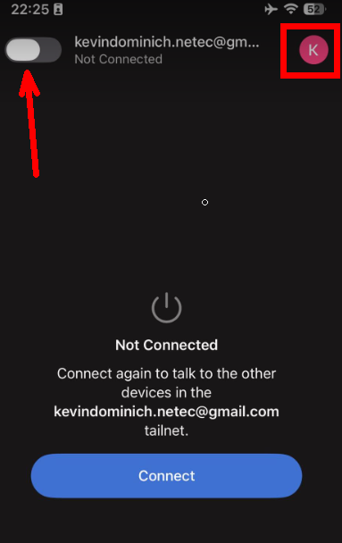

12. Si sale la siguiente pantalla, seleccionar `Dismiss`

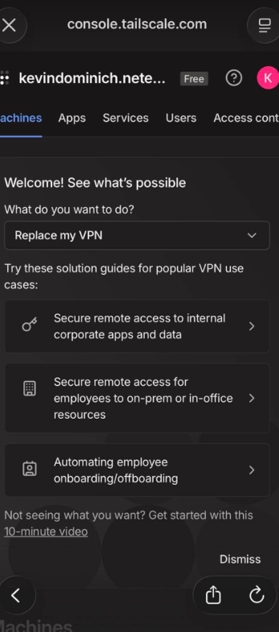

13. Avisarle al Host (Kevin) para que te envie un enlace de conexion

14. Ingresar al enlace y logearse con el mismo correo (o Google) que se uso para usar tailscale

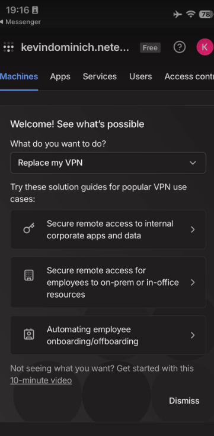

15. Ingresar a Documentos

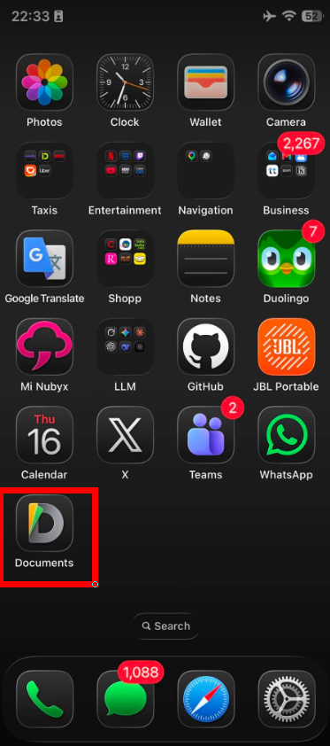

16. Seleccionar `+`

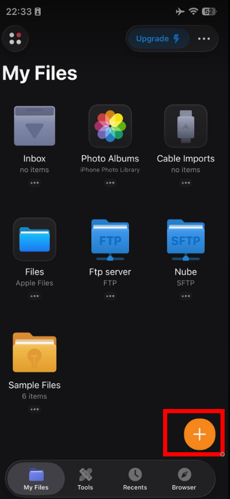

17. Desplazar hacia abajo y seleccionar `Add Cloud Connection`

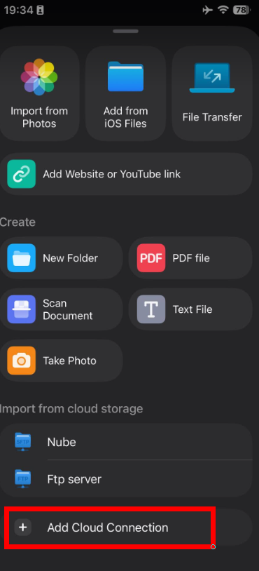

18. Seleccionar `FTP Server`

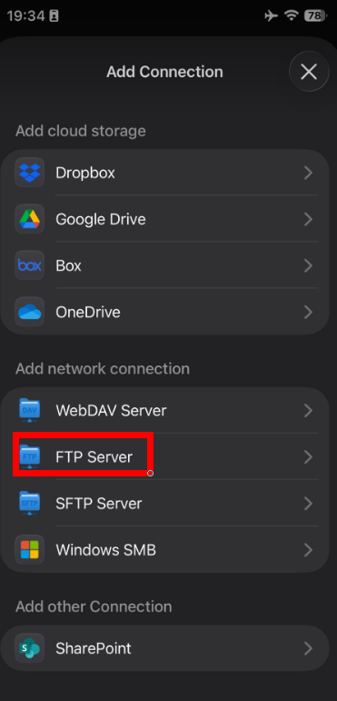

19. Escribe (o copia y pega) los siguientes valores. **Los valores vacios se completan con la informacion que el Host le dio**

* **Title:** `Nube Privada` (o el nombre que prefieras para identificarlo)
* **Host:** `100.67.195.63`
* **Login:** ` `
* **Password:** ` `

#### Advanced

* **Encoding:** `No modificar`
* **Port:** `21`
* **Login path:** `No modificar`

